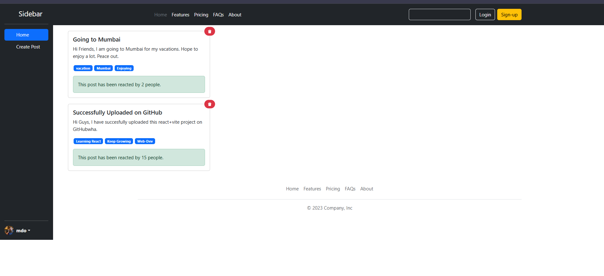

# 🧑‍🤝‍🧑 Social Media App

This is a simple social media application built using **React** and **Vite**. Users can create posts with tags, view them in a card layout, and see reactions from others. The app includes a sidebar for navigation, a responsive layout, and a modern UI design.

## ✨ Features

- 🌐 Create and view posts
- 🏷️ Add tags to posts
- 💬 Show reaction count
- 🧹 Delete posts
- 📱 Responsive sidebar layout
- 🔐 Login and Sign-up buttons (UI only)

## 📸 Screenshot



## 🚀 Tech Stack

- **Frontend**: React + Vite
- **Styling**: CSS, Bootstrap (assumed from UI)
- **Icons**: React Icons

## 🛠️ Getting Started

### Prerequisites

Make sure you have the following installed:

- Node.js (v16 or later)
- npm or yarn

### Installation

```bash
# Clone the repository
git clone https://github.com/titiksha95/social-media-react-vite.git
cd social-media-react-vite

# Install dependencies
npm install
# or
yarn
```

### Run the app

```bash
npm run dev
# or
yarn dev
```


Made with ❤️ using React and Vite

